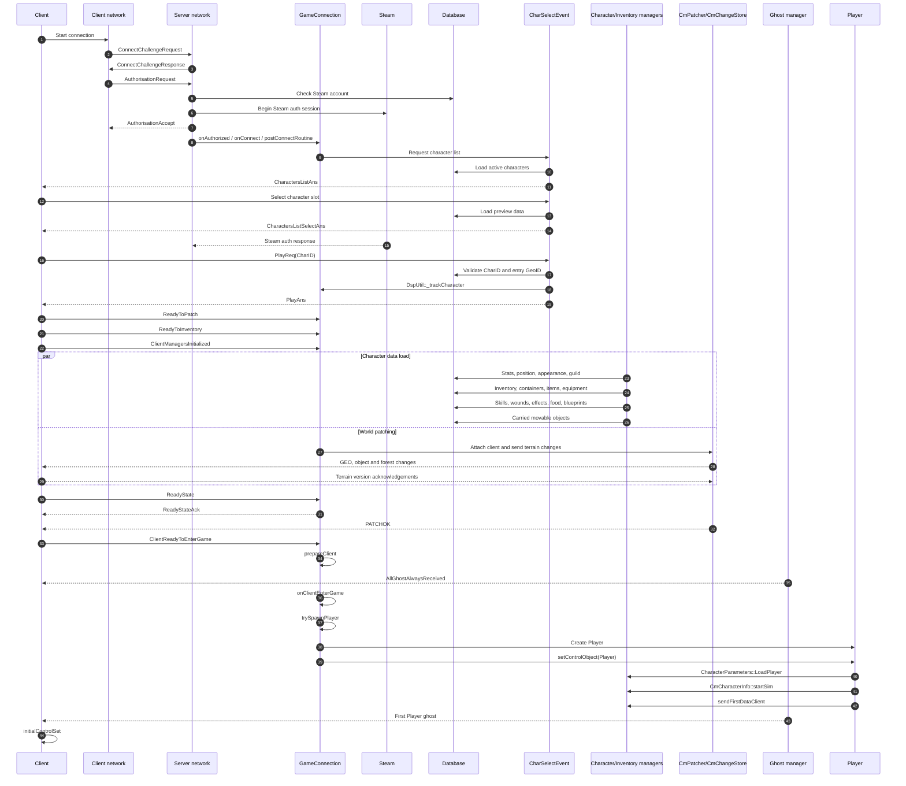

# LiF:YO core character lifecycle — evidence-based client/server reverse engineering

**Author and research lead:** (Zbig / `@Zbig281`)  
**Scope:** connection, Steam authorization, character selection, character loading, inventory, terrain patching, ghosting, player creation, control-object handoff, saving, disconnect cleanup
**Build type:** PE32+ x86-64  
**Image base:** `0x140000000` for both analyzed binaries  
**Offset verification:** **80/80 byte signatures matched** — 57 server entries and 23 client entries  
**Semantic classification:** 73 confirmed entries and 7 high-confidence entries

> This revision addresses the request for practical examples, explicit evidence labels, and a clear distinction between observed behavior and architectural interpretation.  
> It is reverse-engineering documentation, not original engine design documentation.

---

## What this document proves — and what it does not

### Evidence labels used below

- **Observed:** present in a real runtime log from a successful login.
- **Statically confirmed:** recovered from the analyzed client/server binaries and tied to a verified RVA, file offset, and byte signature.
- **High confidence:** supported by control flow, cross-references, or callback bridges, but the exact public symbol or every branch has not been fully recovered.
- **Inferred:** an architectural interpretation connecting observed and statically confirmed components.
- **Unverified:** still requires a controlled runtime test.

The **80/80 result does not mean that every branch and structure field is fully understood**. It proves that the supplied offset database matches the analyzed binary versions and that each RVA maps to the expected bytes. Runtime semantics still require logs, breakpoints, tracing, or controlled tests.

---

## Practical uses

This map is useful for more than naming functions.

### 1. Diagnose a player stuck before spawn

The runtime trace shows `GameConnection::trySpawnPlayer` repeatedly refusing to spawn while a `NetEvent` is still pending:

```text
Client <connection> still has 1 NetEvents pending...
```

The player is created only after:

```text
PATCHOK
→ ClientReadyToEnterGame
→ AllGhostAlwaysReceived
→ trySpawnPlayer
→ GameConnection::setControlObject
```

This lets a server developer distinguish an authorization problem from terrain patching, event-queue, ghosting, or control-object problems.

### 2. Prevent duplicate `Player` creation

Calling `spawnPlayer(connection)` while the same connection still owns a player produces:

```text
Attempting to create a player for a client that already has one!
```

A safe restart must first save, detach control, destroy the old player, and clear the connection state before spawning a replacement.

### 3. Trace delayed Steam rejection

In the observed session, `AuthorisationAccept` was sent before the asynchronous Steam approval callback. That means a client may reach character selection before a later Steam rejection or timeout closes the session.

### 4. Find the real login bottleneck

In the measured local session, most time was spent in terrain patching rather than account validation or final player creation:

| Stage | Observed time |
|---|---:|
| Challenge request → authorization request | `0.016 s` |
| Authorization request → Steam approved | `1.353 s` |
| Play request → readiness commands | `0.454 s` |
| First terrain patch send → `PATCHOK` | `23.296 s` |
| `PATCHOK` → player creation | `0.309 s` |
| Entire challenge → player spawn | `29.204 s` |

These values are one test run, not a universal benchmark.

### 5. Design Primary/Secondary handoff safely

The analysis separates three states that must not be treated as identical:

```text
authenticated connection
character data loaded
active Player control object assigned
```

A Secondary connection may preload character managers, patches, and ghosts without being allowed to own the active `Player`. This is the key boundary for a future seamless handoff implementation.

---

## Complete lifecycle



---

## Runtime evidence from a successful session

Sensitive values have been redacted.

### Transport and authorization — **Observed**

```text
NetInterface::handleConnectChallengeRequest(...)
NetInterface::handleAuthorisationRequest(...) -- seq: <redacted>
CALL p_yo_check_steam_accout_exists(<redacted>);
... connection established ...
```

### Character list and selection — **Observed**

```text
CharSelectEvent::HandleCharactersListReq - AccId=<id>
Found 2 chars for accId=<id>
CharSelectEvent::handleCharactersListSelectReq - slot=0
```

### Asynchronous Steam approval — **Observed**

```text
CmSteam::onAuthResponse() - steam auth approved
```

This callback occurred after the server had already accepted the connection and started character-list handling.

### Play request and session registration — **Observed**

```text
CharSelectEvent::handlePlayReq(...) -- charid=<id>
DspUtil::_trackCharacter(charId: <id> | GID:0x00000000)
```

This demonstrates that `CharID` registration happens before physical `Player` creation.

### Readiness and data loading — **Observed**

```text
ReadyToInventory
ClientManagersInitialized
SELECT BlueprintID ...
SELECT character stats, position, appearance, containers, equipment ...
```

### Spawn blocked by queued network work — **Observed**

```text
GameConnection::trySpawnPlayer
Client <connection> still has 1 NetEvents pending...
```

The same function is called repeatedly until the queue and readiness conditions allow the final spawn.

### Final entry and control handoff — **Observed**

```text
PATCHOK
ClientReadyToEnterGame
AllGhostAlwaysReceived
Player ready to get in, spawning Player object...
CharacterParameters::LoadPlayer()
CmCharacterInfo::startSim(...)
CmCharacterWounds::onSimStarted()
CmCharacterInfo::sendFirstDataClient()
GameConnection::setControlObject() -- set controlling client
Spawned player <id> Player ...
```

This is the strongest practical evidence for the boundary between a loaded logical character and an active player object controlled by the client.

---

## Key server-side lifecycle points

| Phase | Function | RVA | What is supported |
|---|---|---:|---|
| Connection challenge | `NetInterface::handleConnectChallengeRequest` | `0x0054B320` | **Observed + statically confirmed** |
| Authorization receive | `NetInterface::handleAuthorisationRequest` | `0x0054AED6` | **Observed + statically confirmed** |
| Account lookup | `ReadAndCheckSteamDBAccount` | `0x00537150` | **Observed through DB call + statically confirmed** |
| Steam session start | `CmSteam::beginAuthSession` | `0x005703E0` | **Statically confirmed** |
| Steam response | `CmSteam::onAuthResponse` | `0x00570BE0` | **Observed + statically confirmed** |
| Character list | `CharSelectEvent::HandleCharactersListReq` | `0x0052ED70` | **Observed + statically confirmed** |
| Character slot selection | `CharSelectEvent::handleCharactersListSelectReq` | `0x00531C70` | **Observed + statically confirmed** |
| Play request | `CharSelectEvent::handlePlayReq` | `0x0052F200` | **Observed + statically confirmed** |
| Register active CharID | `DspUtil::_trackCharacter` | `0x00536180` | **Observed + statically confirmed** |
| Load character parameters | `CmCharacterInfo::_loadCharParamsFromDb` | `0x001BB790` | **Observed through DB sequence + statically confirmed** |
| Load carried movable | `CmCharacterInfo::_loadCarriedMovableFromDb` | `0x001BB510` | **Statically confirmed** |
| Character data complete | `CmPlayerManager::onDataLoaded` | `0x0028DDB0` | **Statically confirmed** |
| Terrain patch complete | `CmChangeStore::_checkClientPatchCompleted` | `0x004EE450` | **Observed + statically confirmed** |
| Apply loaded state to Player | `CharacterParameters::LoadPlayer` | `0x000954A0` | **Observed + statically confirmed** |
| Assign control object | `GameConnection::setControlObject` | `0x00137D40` | **Observed + statically confirmed** |
| Assign controlling client | `Player::setControllingClient` | `0x001017E0` | **Statically confirmed** |
| Send initial character state | `CmCharacterInfo::sendFirstDataClient` | `0x001C0370` | **Observed + statically confirmed** |
| Save character parameters | `CharacterParameters::SavePlayer` | `0x0009A630` | **Statically confirmed; runtime failure paths need tests** |
| Drop CharID registration | `DspUtil::_dropCharacter` | `0x00535D00` | **Statically confirmed** |
| Drop Steam mapping | `GameConnection::_dropSteamCon` | `0x00134CD0` | **Statically confirmed** |
| Native connection cleanup | `GameConnection teardown / native cleanup path` | `0x00137520` | **High confidence; exact public symbol not recovered** |

---

## Key client-side lifecycle points

| Phase | Function | RVA | What is supported |
|---|---|---:|---|
| Send challenge | `NetInterface::sendConnectChallengeRequest wrapper` | `0x00A35900` | **High confidence** |
| Receive challenge response | `NetInterface::handleConnectChallengeResponse` | `0x00A35550` | **Statically confirmed** |
| Build/send authorization | `NetInterface::sendAuthorisationRequest` | `0x00A35740` | **Statically confirmed** |
| Receive authorization accept | `NetInterface::handleAuthorisationAccept` | `0x00A352D4` | **Statically confirmed** |
| Request character list | `CharSelectEvent::sSendCharactersListReq` | `0x00A30C00` | **Statically confirmed** |
| Request slot preview | `CharSelectEvent::sSendCharactersListSelectReq` | `0x00A30C70` | **Statically confirmed** |
| Request play | `CharSelectEvent::sSendPlayReq` | `0x00A30E30` | **Statically confirmed** |
| Process selected data | `nLogin::ProcessCharSelectedData` | `0x00A49050` | **Statically confirmed** |
| Receive control-object event | `ControlObjectEvent::unpack / handler` | `0x002AB530` | **Statically confirmed** |
| Enter active control state | `GameConnection::initialControlSet native transition` | `0x002A8C50` | **High confidence** |
| GhostAlways callbacks | `GameConnection::onGhostAlwaysObjectsReceived callback` | `0x00A43E52` | **Statically confirmed** |

---

## Confirmed `GameConnection` field layout

These are offsets within the analyzed server-side object, not executable RVAs.

| Object offset | Meaning | Evidence |
|---:|---|---|
| `+0x90` | Connection `SimObjectID` | Confirmed |
| `+0xB10` | `AccountID` | Confirmed by `getAccountId` |
| `+0xB14` | `CharID` | Confirmed by `getCharacterId` |
| `+0xB18` | Selected `GeoID` / entry-location data | High confidence |
| `+0xB38` | Current control-object reference | Confirmed by `setControlObject` |
| `+0xB44` | Character/session name storage | Partially confirmed |
| `+0xC48` | Auxiliary session object cleaned during teardown | Incomplete semantics |
| `+0xC78` | Force-control-update flag | High confidence |

This is a partial reconstruction and must not be treated as a complete class declaration.

---

## Why repeated `trySpawnPlayer` calls are expected

### Observed

The function runs repeatedly while patching and network events are still completing.

### Statically supported

The server contains:

- event-queue handling;
- terrain patch completion checks;
- ghosting code;
- control-object assignment;
- explicit readiness commands in TorqueScript.

### Inferred gate

The final spawn appears to require a combined state equivalent to:

```text
character data loaded
AND inventory/managers ready
AND terrain patching complete
AND client ready to enter
AND GhostAlways objects received
AND relevant NetEvent queue drained
AND no existing Player/control object
```

The exact single Boolean expression used by the script/native boundary has not yet been recovered in full and remains **unverified**.

---

## Saving and disconnect cleanup

### Statically confirmed components

```text
CharacterParameters::SavePlayer
DspUtil::_dropCharacter
GameConnection::_dropSteamCon
CmPatcher::detachClient
YoCsServer::detachClientConnection
NetConnection ghost cleanup
GameConnection native teardown
```

### High-confidence cleanup order

```text
save or save-and-destruct Player
→ clear/detach control object
→ remove active CharID registration
→ detach patching and ghosts
→ end/drop Steam session
→ destroy auxiliary session data
→ base NetConnection cleanup
```

### Still unverified

- exact ordering for timeout versus clean disconnect;
- behavior if an asynchronous DB callback returns after the connection was removed;
- every save path during process termination;
- cleanup at each possible point between `PATCHOK` and `setControlObject`.

---

## Safe character restart example

A direct second call to `spawnPlayer` is unsafe while the old object remains active.

Conceptual safe sequence:

```torquescript
%player = %client.getControlObject();

if (isObject(%player))
{
    %player.saveAndDestructPlayer();

    if (isObject(%player))
    {
        %player.delete();
    }
}

%client.setControlObject(0);
%client.Player = 0;

spawnPlayer(%client);
```

This is an example of the required lifecycle order, not a claim that every LiF:YO script build uses the same `%client.Player` field or that `saveAndDestructPlayer()` always deletes the object itself. Those details must be checked in the target script build.

---

## Primary / Secondary interpretation

### Supported by recovered systems

- `AccountID` and `CharID` exist independently of the active control object.
- character data is loaded before the physical `Player` is spawned;
- `DspUtil` tracks the active character;
- control ownership is transferred through `GameConnection::setControlObject`, `Player::setControllingClient`, and `ControlObjectEvent`;
- ghosting and patching complete before active control begins.

### Architectural inference

A Secondary server can potentially prepare:

```text
authenticated connection
character managers
inventory/state data
terrain patches
GhostAlways objects
```

while deliberately withholding:

```text
active Player control object
```

A safe handoff still requires a transaction/rollback design for:

```text
CharID tracking
Player ObjectGID
mount/horse/cart relationships
position and velocity
pending NetEvents
old controlling connection
save/cleanup ownership
```

No seamless Primary/Secondary handoff is claimed as completed by this document.

---

## Verification method

The supplied verifier checks:

```text
PE32+ format
ImageBase
RVA-to-file-offset mapping
first 16 bytes at every database entry
expected server/client build
```

Results:

```text
checked:     80
matching:    80
mismatching: 0
server:      57
client:      23
```

A signature mismatch means the offset must not be used until the surrounding control flow and cross-references are re-analyzed.

---

## Full verified server offset appendix

<details>
<summary>Show all 57 server entries</summary>

| Side | Category | Function / point | RVA | File offset | Signature (first 16 bytes) | Evidence |
|---|---|---|---:|---:|---|---|
| Server | Transport and authorization | `ReadAndCheckSteamDBAccount` | `0x00537150` | `0x00536550` | `48 8B C4 48 89 48 08 55 41 54 41 55 41 56 41 57` | **Confirmed** |
| Server | Transport and authorization | `NetConnection::readAuthorisationRequest` | `0x005376C0` | `0x00536AC0` | `48 8B C4 55 41 56 41 57 48 8D A8 18 F7 FF FF 48` | **Confirmed** |
| Server | Transport and authorization | `NetConnection::readAuthorisationRequest_dispatch` | `0x00537970` | `0x00536D70` | `40 57 B8 80 19 00 00 E8 54 80 1A 00 48 2B E0 48` | **Confirmed** |
| Server | Transport and authorization | `NetConnection::writeAuthorisationRequest` | `0x00537D70` | `0x00537170` | `48 89 5C 24 08 57 B8 30 19 00 00 E8 50 7C 1A 00` | **Confirmed** |
| Server | Transport and authorization | `NetInterface::handleAuthorisationRequest` | `0x0054AED6` | `0x0054A2D6` | `48 89 BC 24 88 32 00 00 49 8B CE E8 3A 88 FB FF` | **Confirmed** |
| Server | Transport and authorization | `NetInterface::handleConnectChallengeRequest` | `0x0054B320` | `0x0054A720` | `48 89 5C 24 10 48 89 74 24 18 57 B8 30 19 00 00` | **Confirmed** |
| Server | Transport and authorization | `NetInterface::sendAuthorisationAccept` | `0x0054B4B0` | `0x0054A8B0` | `48 89 5C 24 08 57 B8 30 19 00 00 E8 10 45 19 00` | **Confirmed** |
| Server | Steam authentication | `CmSteam::beginAuthSession` | `0x005703E0` | `0x0056F7E0` | `48 89 54 24 10 57 48 83 EC 50 48 C7 44 24 30 FE` | **Confirmed** |
| Server | Steam authentication | `CmSteam::_registerAuthTimeoutEvent` | `0x0056F7C0` | `0x0056EBC0` | `48 89 54 24 10 55 56 57 41 56 41 57 48 83 EC 70` | **Confirmed** |
| Server | Steam authentication | `CmSteam::_removeAuthTimeoutEvent` | `0x0056F9F0` | `0x0056EDF0` | `48 89 54 24 10 57 48 83 EC 40 48 C7 44 24 30 FE` | **Confirmed** |
| Server | Steam authentication | `CmSteam::endAuthSession` | `0x005707A0` | `0x0056FBA0` | `48 89 54 24 10 57 48 83 EC 50 48 C7 44 24 30 FE` | **Confirmed** |
| Server | Steam authentication | `CmSteam::onAuthResponse` | `0x00570BE0` | `0x0056FFE0` | `40 53 B8 30 18 00 00 E8 E4 ED 16 00 48 2B E0 80` | **Confirmed** |
| Server | Steam authentication | `CmSteam::onAuthTimeout` | `0x00570E00` | `0x00570200` | `48 89 54 24 10 57 B8 50 18 00 00 E8 C0 EB 16 00` | **Confirmed** |
| Server | Steam authentication | `GameConnection::_dropSteamCon` | `0x00134CD0` | `0x001340D0` | `40 57 48 83 EC 40 48 8B F9 48 8B 89 68 0C 00 00` | **Confirmed** |
| Server | Steam authentication | `GameConnection::sAddSteamCon` | `0x00137B40` | `0x00136F40` | `40 53 48 83 EC 40 48 8B D9 48 85 C9 0F 84 8B 00` | **Confirmed** |
| Server | Steam authentication | `Steam rejection / connection drop path` | `0x001375D0` | `0x001369D0` | `E9 08 20 5F 00 90 90 90 90 90 90 90 48 2B E0 48` | **High confidence** |
| Server | Character selection | `CharSelectEvent::HandleCharactersListReq` | `0x0052ED70` | `0x0052E170` | `40 55 53 56 57 41 56 41 57 48 8D AC 24 28 DE FF` | **Confirmed** |
| Server | Character selection | `CharSelectEvent::HandleCharactersListReq async callback` | `0x0052DF30` | `0x0052D330` | `4C 89 4C 24 20 55 56 57 41 56 41 57 B8 60 18 00` | **Confirmed** |
| Server | Character selection | `CharSelectEvent::sSendCharactersListAns` | `0x00532C80` | `0x00532080` | `48 8B C4 55 57 41 54 41 56 41 57 48 8D A8 38 F8` | **Confirmed** |
| Server | Character selection | `CharSelectEvent::handleCharactersListSelectReq` | `0x00531C70` | `0x00531070` | `40 55 56 57 41 56 41 57 48 8D AC 24 90 F6 FF FF` | **Confirmed** |
| Server | Character selection | `CharSelectEvent::handleCharactersListSelectReq async callback` | `0x0052B950` | `0x0052AD50` | `40 57 B8 40 18 00 00 E8 74 40 1B 00 48 2B E0 48` | **Confirmed** |
| Server | Character selection | `CharSelectEvent::sSendCharactersListSelectAns` | `0x00532F20` | `0x00532320` | `40 55 56 57 41 56 41 57 48 8D AC 24 60 F8 FF FF` | **Confirmed** |
| Server | Character selection | `CharSelectEvent::handlePlayReq` | `0x0052F200` | `0x0052E600` | `89 54 24 10 55 53 56 57 41 56 41 57 48 8D AC 24` | **Confirmed** |
| Server | Character selection | `CharSelectEvent::sSendPlayAns` | `0x00533230` | `0x00532630` | `40 55 56 57 41 54 41 55 41 56 41 57 48 8D AC 24` | **Confirmed** |
| Server | Character selection | `CharSelectEvent::_checkCharInDb` | `0x0052F570` | `0x0052E970` | `48 8B C4 89 48 08 55 48 8D 68 A1 48 81 EC C0 00` | **Confirmed** |
| Server | Character selection | `CharSelectEvent::_createCharacterInDb` | `0x0052F950` | `0x0052ED50` | `40 55 56 57 41 54 41 55 41 56 41 57 48 8D AC 24` | **Confirmed** |
| Server | Dispatcher / session | `DspUtil::_trackCharacter` | `0x00536180` | `0x00535580` | `4C 89 44 24 18 56 57 41 55 41 56 41 57 B8 70 30` | **Confirmed** |
| Server | Dispatcher / session | `DspUtil::_dropCharacter` | `0x00535D00` | `0x00535100` | `40 53 56 57 41 56 41 57 B8 50 30 00 00 E8 BE 9C` | **Confirmed** |
| Server | Dispatcher / session | `DspUtil::onAdd` | `0x00536900` | `0x00535D00` | `40 53 48 83 EC 50 48 C7 44 24 30 FE FF FF FF 48` | **Confirmed** |
| Server | Dispatcher / session | `DspUtil::onRemove` | `0x00536A30` | `0x00535E30` | `48 8B C4 41 56 48 83 EC 50 48 C7 40 D8 FE FF FF` | **Confirmed** |
| Server | GameConnection fields | `GameConnection::getAccountId` | `0x00134A70` | `0x00133E70` | `8B 81 10 0B 00 00 C3 CC CC CC CC CC CC CC CC CC` | **Confirmed** |
| Server | GameConnection fields | `GameConnection::getCharacterId` | `0x00134A80` | `0x00133E80` | `8B 81 14 0B 00 00 C3 CC CC CC CC CC CC CC CC CC` | **Confirmed** |
| Server | Spawn and control | `GameConnection::setControlObject` | `0x00137D40` | `0x00137140` | `48 89 5C 24 20 56 57 41 56 48 83 EC 20 48 8B 81` | **Confirmed** |
| Server | Spawn and control | `ControlObjectEvent::unpack / handler` | `0x00138110` | `0x00137510` | `48 89 5C 24 08 48 89 74 24 10 57 B8 50 18 00 00` | **Confirmed** |
| Server | Spawn and control | `Player::setControllingClient` | `0x001017E0` | `0x00100BE0` | `40 55 41 56 41 57 48 8D AC 24 70 A0 FF FF B8 90` | **Confirmed** |
| Server | Character loading | `CharacterStatsAPI::CharacterParameters::LoadPlayer` | `0x000954A0` | `0x000948A0` | `40 55 56 57 41 56 41 57 B8 90 18 00 00 E8 1E A5` | **Confirmed** |
| Server | Save and logout | `CharacterStatsAPI::CharacterParameters::SavePlayer` | `0x0009A630` | `0x00099A30` | `44 88 4C 24 20 48 89 4C 24 08 55 56 57 41 54 41` | **Confirmed** |
| Server | Character loading | `CmCharacterInfo::_loadCarriedMovableFromDb` | `0x001BB510` | `0x001BA910` | `48 8B C4 55 41 56 41 57 48 8D A8 08 F8 FF FF 48` | **Confirmed** |
| Server | Character loading | `CmCharacterInfo::_loadCharParamsFromDb` | `0x001BB790` | `0x001BAB90` | `48 8B C4 55 57 41 56 48 8D 68 A1 48 81 EC D0 00` | **Confirmed** |
| Server | Character loading | `CmCharacterInfo::sendFirstDataClient` | `0x001C0370` | `0x001BF770` | `41 56 B8 60 30 00 00 E8 54 F6 51 00 48 2B E0 48` | **Confirmed** |
| Server | Character loading | `CmPlayerManager::onDataLoaded` | `0x0028DDB0` | `0x0028D1B0` | `40 53 48 83 EC 30 8B CA E8 93 6B EA FF 48 8B D8` | **Confirmed** |
| Server | Inventory | `CmInventoryPlayer::setRootContainer` | `0x00290D30` | `0x00290130` | `40 55 56 57 48 83 EC 50 48 C7 44 24 30 FE FF FF` | **Confirmed** |
| Server | Save and logout | `GameConnection teardown / native cleanup path` | `0x00137520` | `0x00136920` | `48 89 5C 24 08 57 48 83 EC 20 48 8B D9 E8 9E D7` | **High confidence** |
| Server | Terrain patching | `CmChangeStore::_sendPatchToClient` | `0x004F65C0` | `0x004F59C0` | `89 54 24 10 55 53 56 57 41 54 41 55 41 56 41 57` | **Confirmed** |
| Server | Terrain patching | `CmChangeStore::_checkClientPatchCompleted` | `0x004EE450` | `0x004ED850` | `89 54 24 10 56 57 41 56 B8 60 18 00 00 E8 6E 15` | **Confirmed** |
| Server | Terrain patching | `CmPatcher::attachClient` | `0x004F95A0` | `0x004F89A0` | `48 89 5C 24 08 48 89 6C 24 10 48 89 74 24 18 57` | **Confirmed** |
| Server | Terrain patching | `CmPatcher::detachClient` | `0x004FA0F0` | `0x004F94F0` | `48 89 5C 24 08 48 89 74 24 10 57 B8 30 18 00 00` | **Confirmed** |
| Server | Terrain patching | `CmPatcher::_onClientDisconnected` | `0x004F1280` | `0x004F0680` | `40 57 48 83 EC 50 48 C7 44 24 30 FE FF FF FF 48` | **Confirmed** |
| Server | Terrain patching | `YoCsServer::attachClientConnection` | `0x004FF0C0` | `0x004FE4C0` | `40 53 48 83 EC 40 48 8B D9 85 D2 79 32 48 8D 05` | **Confirmed** |
| Server | Terrain patching | `YoCsServer::detachClientConnection` | `0x004FFF70` | `0x004FF370` | `40 55 56 48 83 EC 38 8B EA 48 8B F1 85 D2 75 30` | **Confirmed** |
| Server | Terrain patching | `YoCsServer::_isClientPatchedAllTers` | `0x004FF220` | `0x004FE620` | `48 83 EC 58 44 8B C2 4C 8B C9 85 D2 75 31 48 8D` | **Confirmed** |
| Server | Terrain patching | `CmPatcher::_isClientPatchedAllTers` | `0x004EE620` | `0x004EDA20` | `40 57 48 83 EC 50 48 C7 44 24 30 FE FF FF FF 48` | **Confirmed** |
| Server | Networking / NetEvents | `NetConnection::postNetEvent` | `0x00542CC0` | `0x005420C0` | `40 53 55 56 57 41 56 B8 70 18 00 00 E8 FF CC 19` | **Confirmed** |
| Server | Networking / NetEvents | `NetConnection::eventWritePacket` | `0x00542630` | `0x00541A30` | `48 89 5C 24 20 4C 89 44 24 18 55 56 57 41 54 41` | **Confirmed** |
| Server | Networking / NetEvents | `NetConnection::eventReadPacket` | `0x00541720` | `0x00540B20` | `48 89 54 24 10 55 53 56 57 41 54 41 55 41 56 41` | **Confirmed** |
| Server | Ghosting | `NetConnection::ghostWritePacket` | `0x00546150` | `0x00545550` | `40 53 41 54 41 55 41 56 48 83 EC 78 4C 8B F2 4D` | **Confirmed** |
| Server | Ghosting | `NetConnection::objectLocalClearAlways` | `0x00546C30` | `0x00546030` | `B8 38 18 00 00 E8 96 8D 19 00 48 2B E0 48 83 B9` | **Confirmed** |

</details>

---

## Full verified client offset appendix

<details>
<summary>Show all 23 client entries</summary>

| Side | Category | Function / point | RVA | File offset | Signature (first 16 bytes) | Evidence |
|---|---|---|---:|---:|---|---|
| Client | Transport and authorization | `NetInterface::handleAuthorisationAccept` | `0x00A352D4` | `0x00A346D4` | `48 89 BC 24 50 09 00 00 8B B8 90 00 00 00 E8 E9` | **Confirmed** |
| Client | Transport and authorization | `NetInterface::handleAuthorisationReject` | `0x00A35460` | `0x00A34860` | `48 89 5C 24 08 48 89 74 24 10 57 48 81 EC 20 0A` | **Confirmed** |
| Client | Transport and authorization | `NetInterface::handleConnectChallengeResponse` | `0x00A35550` | `0x00A34950` | `48 89 5C 24 08 48 89 74 24 10 57 48 81 EC 30 09` | **Confirmed** |
| Client | Transport and authorization | `NetInterface::sendAuthorisationRequest` | `0x00A35740` | `0x00A34B40` | `48 89 5C 24 08 48 89 6C 24 10 48 89 74 24 18 57` | **Confirmed** |
| Client | Transport and authorization | `NetInterface::sendConnectChallengeRequest wrapper` | `0x00A35900` | `0x00A34D00` | `48 89 5C 24 08 57 48 81 EC 30 09 00 00 48 8B CA` | **High confidence** |
| Client | Transport and authorization | `NetInterface::sendConnectChallengeRequest transmit path` | `0x00A359C0` | `0x00A34DC0` | `48 89 5C 24 08 48 89 74 24 10 57 B8 30 11 00 00` | **High confidence** |
| Client | Transport and authorization | `NetConnection::writeAuthorisationRequest_dispatch` | `0x00A34F40` | `0x00A34340` | `48 8B C4 57 48 81 EC 70 08 00 00 48 C7 44 24 60` | **Confirmed** |
| Client | Steam authentication | `CmSteam::getAuthSessionTicket` | `0x00A61A70` | `0x00A60E70` | `40 55 56 57 41 54 41 55 41 56 41 57 48 8D AC 24` | **Confirmed** |
| Client | Character selection | `CharSelectEvent::sSendCharactersListReq` | `0x00A30C00` | `0x00A30000` | `40 57 48 83 EC 30 48 C7 44 24 20 FE FF FF FF 48` | **Confirmed** |
| Client | Character selection | `CharSelectEvent::sSendCharactersListSelectReq` | `0x00A30C70` | `0x00A30070` | `40 57 48 83 EC 30 48 C7 44 24 20 FE FF FF FF 48` | **Confirmed** |
| Client | Character selection | `CharSelectEvent::sSendPlayReq` | `0x00A30E30` | `0x00A30230` | `40 55 56 57 48 83 EC 30 48 C7 44 24 20 FE FF FF` | **Confirmed** |
| Client | Character selection | `CharSelectEvent::handleCharactersListAns` | `0x00A30330` | `0x00A2F730` | `40 57 48 83 EC 50 48 C7 44 24 20 FE FF FF FF 48` | **Confirmed** |
| Client | Character selection | `CharSelectEvent::handleCharactersListSelectAns` | `0x00A30430` | `0x00A2F830` | `40 53 48 81 EC 80 00 00 00 48 C7 44 24 20 FE FF` | **Confirmed** |
| Client | Character selection | `CharSelectEvent::handlePlayAns` | `0x00A30660` | `0x00A2FA60` | `48 89 5C 24 08 48 89 74 24 10 57 48 81 EC 20 08` | **Confirmed** |
| Client | Character selection | `CharSelectEvent answer dispatch` | `0x00A30810` | `0x00A2FC10` | `48 8B C4 57 48 81 EC A0 00 00 00 48 C7 44 24 20` | **Confirmed** |
| Client | Character selection | `nLogin::ProcessCharSelectedData` | `0x00A49050` | `0x00A48450` | `40 57 41 54 41 55 41 56 41 57 B8 80 10 00 00 E8` | **Confirmed** |
| Client | Ghosting and control | `GameConnection::initialControlSet callback bridge A` | `0x00043AF0` | `0x00042EF0` | `48 83 EC 38 48 8D 05 35 60 4F 01 4C 8D 0D 3E D9` | **High confidence** |
| Client | Ghosting and control | `GameConnection::initialControlSet callback bridge B` | `0x00043E50` | `0x00043250` | `48 83 EC 58 C7 44 24 48 01 00 00 00 48 8D 05 25` | **High confidence** |
| Client | Ghosting and control | `GameConnection::initialControlSet native transition` | `0x002A8C50` | `0x002A8050` | `40 53 48 81 EC B0 00 00 00 48 C7 44 24 20 FE FF` | **High confidence** |
| Client | Ghosting and control | `GameConnection::onGhostAlwaysStarted callback` | `0x00A43D51` | `0x00A43151` | `48 89 5C 24 40 48 89 74 24 48 85 D2 0F 84 65 01` | **Confirmed** |
| Client | Ghosting and control | `GameConnection::onGhostAlwaysObjectsReceived callback` | `0x00A43E52` | `0x00A43252` | `44 3B 81 E0 08 00 00 0F 85 AF 00 00 00 48 8D 15` | **Confirmed** |
| Client | Ghosting and control | `GameConnection::onGhostAlwaysObjectReceived callback` | `0x00A44570` | `0x00A43970` | `40 56 57 48 81 EC 48 08 00 00 48 8B F9 48 8B F2` | **Confirmed** |
| Client | Ghosting and control | `ControlObjectEvent::unpack / handler` | `0x002AB530` | `0x002AA930` | `48 89 5C 24 08 48 89 6C 24 10 48 89 74 24 18 57` | **Confirmed** |

</details>

---

## Remaining controlled tests

- rejected Steam ticket;
- Steam timeout after preliminary acceptance;
- inactive account;
- CharID belonging to another AccountID;
- disconnect during inventory loading;
- disconnect during terrain patching;
- disconnect after `PATCHOK` but before `ClientReadyToEnterGame`;
- disconnect after `AllGhostAlwaysReceived` but before player creation;
- disconnect during control-object assignment;
- immediate reconnect;
- duplicate login of the same account;
- duplicate login of the same CharID;
- player restart without disconnect;
- Primary → Secondary → Primary handoff.

Each test should record:

```text
GameConnection SimObjectID
AccountID
CharID
GeoID
Steam auth state
DspUtil tracking state
Player SimObjectID
ObjectGID
control object
event queue size
events sent
terrain patch completion
session generation number
elapsed time
```

---

## Included research artifacts

Recommended assets for the PR or release:

```text
LIFYO_CORE_CHARACTER_LIFECYCLE_GITHUB_POST_EN.md
LIFYO_LOGIN_OFFSET_DATABASE_PL.json
LIFYO_LOGIN_OFFSET_DATABASE_PL.csv
LIFYO_LOGIN_OFFSETS_WERYFIKACJA.md
VERIFY_LOGIN_OFFSETS_PL.py
LiFxLoginLifecycleTrace_mod.cs
```

---

## AI-assistance note

AI-assisted tools were used to organize the recovered information, compare reports, structure the tables, and improve the readability of this document.

The technical basis of the document is the supplied client/server binaries, recovered function names, byte-signature verification, runtime logs, database queries, TorqueScript/LiFx traces, and manual review. Architectural interpretations are labeled as inferred or unverified rather than presented as original engine design facts.

---

## Credit

Research, reverse engineering, testing direction, and project ownership:

**(Zbig / `@Zbig281`)**

Please retain this credit when reusing or extending the offset database or lifecycle analysis.
